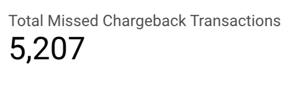

## 1. Overview

Deel clients can add funds to their Deel account using their credit and debit cards. Deel has partnered with Globepay to process all of these account funding credit and debit card transactions. Globepay is an industry-leading global payment processor and is able to process payments in many currencies from cards domiciled in many countries. Deel has connectivity into Globepay using their API. Deel clients provide their credit and debit details within the Deel web application, Deel systems pass those credentials along with any relevant transaction details to Globepay for processing. 

This project helps in creating models to answer a few questions about payments using 2 source files
 - Globepay Acceptance Report.csv
 - Globepay Chargeback Report.csv


## 2. Setup

1. Install DBT Core and bigquery adapter using pip install dbt && pip install dbt-bigquery
2. Update /Users/<username>/.dbt/profiles.yml to add the following information
```
deel_dbt_project:
  outputs:
    dev:
      dataset: Deel_payment_dataset
      job_execution_timeout_seconds: 300
      job_retries: 1
      keyfile: <serviceaccount keyfile json>
      location: EU
      method: service-account
      priority: interactive
      project: deel-dbt-exercise
      threads: 4
      type: bigquery
  target: dev
```

3. Run `dbt debug` to validate the connection with bigquery from deel_dbt_project directory
4. Run `dbt build` to create and test models
5. Run `dbt docs generate` and `dbt docs serve` to generate and view the documentation at `http://localhost:8080`


## 3. Part 1: Ingest and Model the Data

### 3.1 Preliminary Data Exploration

#### 1. Dataset: `global_acceptance_report.csv`
##### Fields:
- **`external_ref`**: Unique transaction identifier.
- **`status`**: Indicates whether the data is valid (`TRUE`) or not.
- **`source`**: Source system for transactions, expected to be `GLOBALPAY`.
- **`ref`**: Event reference identifier from Globepay.
- **`date_time`**: Timestamp of the transaction (ISO 8601 format).
- **`state`**: Transaction state, e.g., `DECLINED`, `ACCEPTED`.
- **`cvv_provided`**: Boolean flag indicating if CVV was provided.
- **`amount`**: Transaction amount.
- **`country`**: Country of the card used in the transaction.
- **`currency`**: Currency of the transaction amount.
- **`rates`**: JSON-formatted exchange rates for different currencies (e.g., `{"USD": 1, "EUR": 0.926}`).

#### 2. Dataset: `global_chargeback_report.csv`
##### Fields:
- **`external_ref`**: Links to `global_acceptance_report.csv` for chargeback details.
- **`status`**: Indicates whether the data is valid (`TRUE`) or not.
- **`source`**: Source system for transactions, expected to be `GLOBALPAY`.
- **`chargeback`**: Boolean flag indicating if the transaction had a chargeback.

#### 3. General Observations
- The `external_ref` field is a common identifier, essential for merging the datasets.
- The `chargeback` field provides critical information for chargeback analysis.
- `status` is always for both the datasets
- For 1 transaction amount is negative. Not sure if this is an intended flow or data anomaly
- `rates` requires JSON parsing for conversion and analytical purposes.

---

### 3.2 Model architecture


The model architecture is modular, with the following layers:

 - **Macros**: Includes reusable logic like calculate_amount_in_usd for currency conversion.
 - **Staging**: Cleans and standardizes raw data (acceptance_report and chargeback_report) from seed files.
 - **Intermediate**: Combines and enriches data for analysis (transaction_analysis).
- **Dimension Layer**: Provides curated views (dim_transactions, dim_currencies) for enriched analytics.
- **Payment Analytics**: Focuses on business metrics such as declined_over_25M, missing_chargeback, and overall_acceptance_rate.
- **Seeds**: Raw input files (Globepay_*) used for initial data ingestion.

### 3.2 Lineage graphs


## 4. Part 2: Data Analysis

### 4.1. What is the acceptance rate over time?


- [overall_acceptance_rate.sql](models/payment_analytics/overall_acceptance_rate.sql) : this is the query/dataset to show the acceptance rate over time

### 4.2. List the countries where the amount of declined transactions went over $25M


- [declined_over_25M.sql](models/payment_analytics/declined_over_25M.sql) : Query to show the countries where the amount of declined transactions went over $25M


### 4.3. Which transactions are missing chargeback data?

 

 - [missing_chargeback.sql](models/payment_analytics/missing_chargeback.sql) : Query to show transactions are missing chargeback data


## Resources:
- Learn more about dbt [in the docs](https://docs.getdbt.com/docs/introduction)
- Check out [Discourse](https://discourse.getdbt.com/) for commonly asked questions and answers
- Join the [chat](https://community.getdbt.com/) on Slack for live discussions and support
- Find [dbt events](https://events.getdbt.com) near you
- Check out [the blog](https://blog.getdbt.com/) for the latest news on dbt's development and best practices
